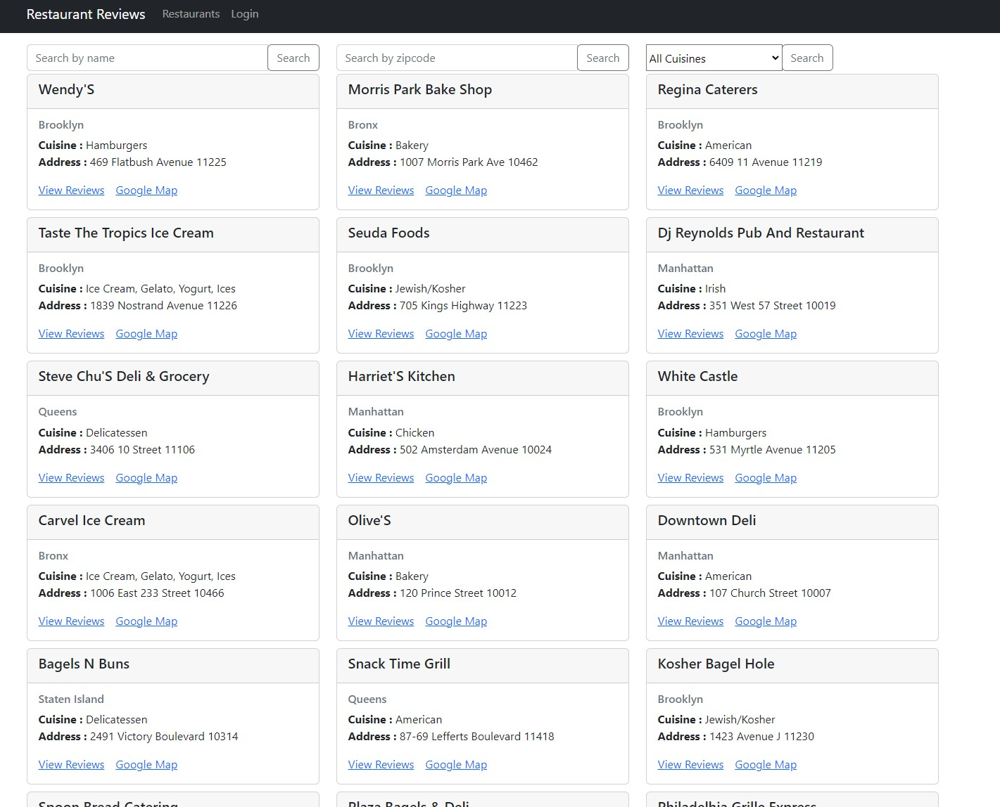
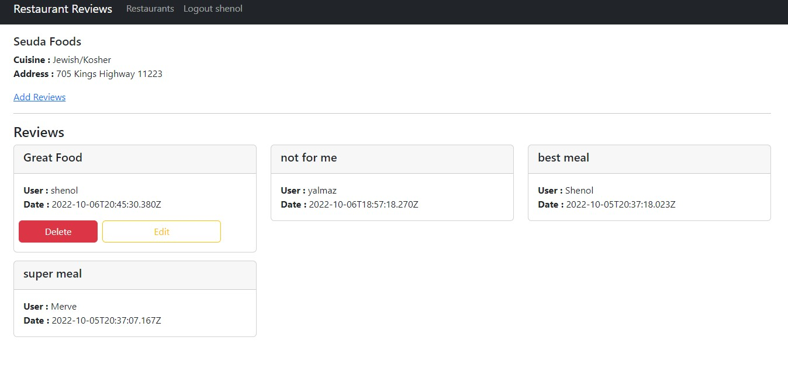
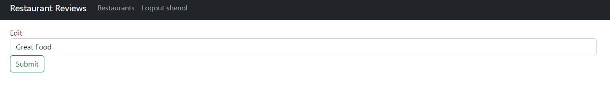
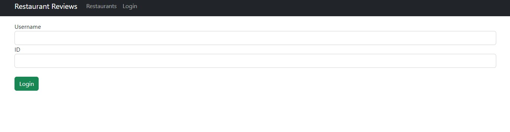

# Mern restaurant review web app
# Backend With MongoDb and Express with NodeJs
## start ``nodemon server`` inside backend folder. Link for local restaurants go link `http://localhost:5000/api/v1/restaurants`

### To build app :

for this project installed $ `npm install express cors mongodb dotenv` , $ `npm install -g nodemon` and $ `npm install body-parser` 

MongoDB [link](https://cloud.mongodb.com/). used sample db restaurants. for name search added index

Postman uses for test api.

## Postman Api call links:

### "get" http://localhost:5000/api/v1/restaurants

### "Post" http://localhost:5000/api/v1/restaurants/reviews

Body/Json `{
"restaurant_id":"5eb3d668b31de5d588f4292d",
"text":"Great Food!",
"user_id":"1234",
"name":"Shenol"    
}`

### "get" http://localhost:5000/api/v1/restaurants?zipcode=11225
### "get" http://localhost:5000/api/v1/restaurants?zipcode=11225&page=2
### "get" http://localhost:5000/api/v1/restaurants?cuisine=American
### "get" http://localhost:5000/api/v1/restaurants?name=food
### "post" http://localhost:5000/api/v1/restaurants/review
Body/json `{
"restaurant_id":"5eb3d668b31de5d588f42935",
"text":"Vegan Chikpea Rulle",
"user_id":"40388637",
"name":"Merve"    
}`

### "put" http://localhost:5000/api/v1/restaurants/review
Body/json `{
"review_id":"633ca27a03254c211537db7d",
"text":"Great Food was that",
"user_id":"40388637",
"name":"Shenol"    
}`

### "delete" http://localhost:5000/api/v1/restaurants/review?id=633ca27a03254c211537db7d (restauranid)
Body/json `{
"user_id":"40388637",
"name":"Shenol"    
}`

### "get" http://localhost:5000/api/v1/restaurants/id/5eb3d668b31de5d588f42bde (restaurantid)

# Frontend With React and Bootstrap

installed react with couple extra packages: 
`npx create-react-app frontend` , `npm install react-router-dom@5`. `npm install bootstrap` , `npm install axios`

Axios uses for api calls

Test user: shenol
Tes user id:1234
Test zipcode rest: 11223 (Seuda Foods)

Screenshots:

